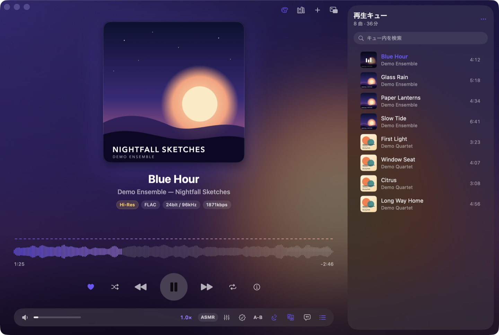
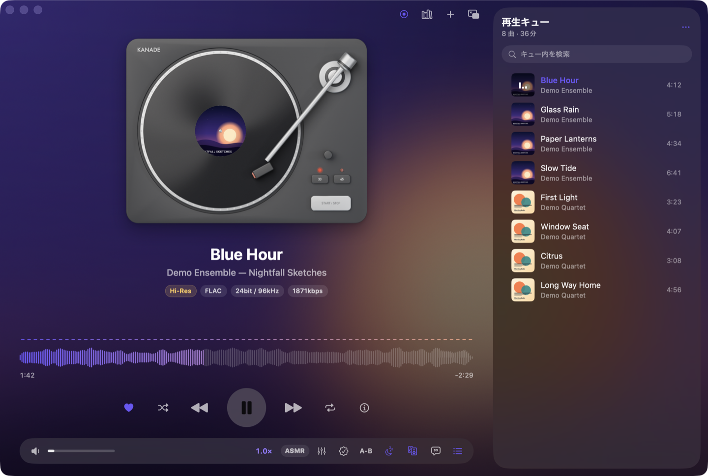
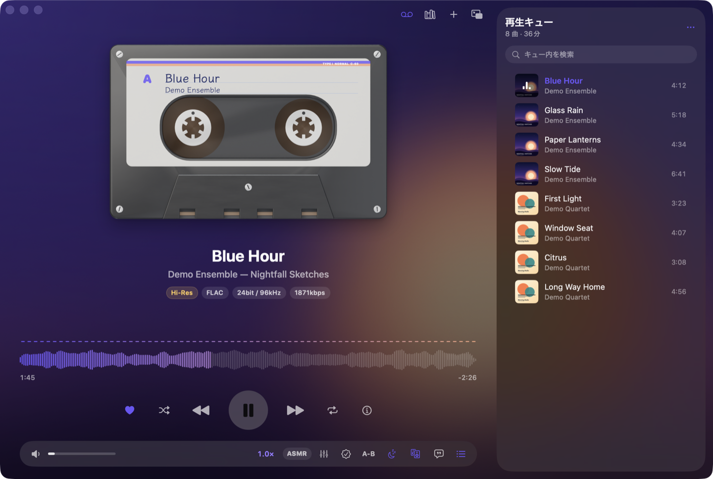
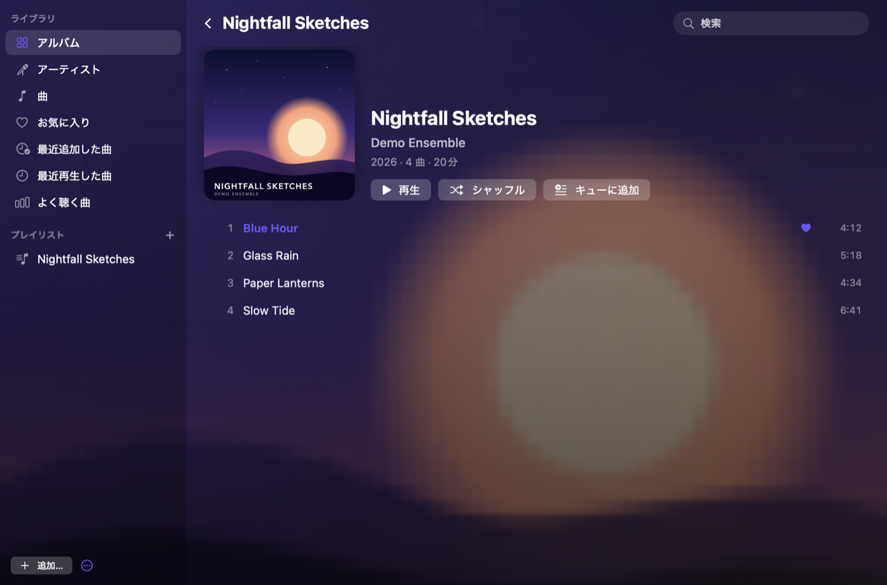
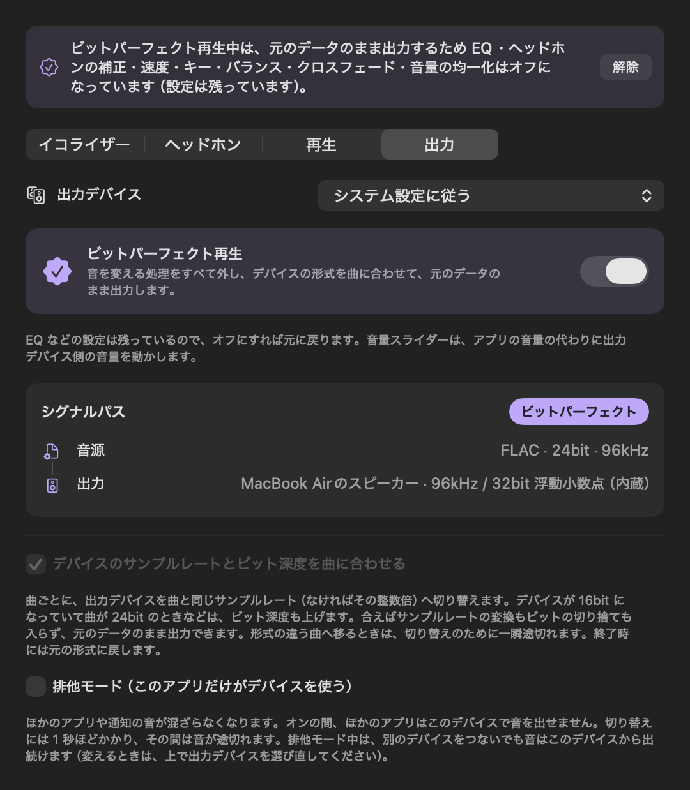

# Kanade — どんな音源でも再生できる Mac 用ミュージックプレイヤー

SwiftUI と AVAudioEngine で作った macOS 26 以降向けのネイティブアプリです。
ロスレス・ハイレゾから DSD・APE などの珍しい形式まで再生できます。元のデータを 1 ビットも変えない出力、DSD のネイティブ再生（DoP）、アップサンプリング、ヘッドホン補正用のパラメトリック EQ、ライブラリとプレイリスト、レコードプレイヤーやカセットデッキの見た目、ASMR 向けの再生モードを備えています。

<p align="center">
  
</p>
<p align="center">
  
  
</p>
<p align="center">
  
  
</p>

上から、再生画面、見た目を変えたところ（レコードプレイヤー・カセットデッキ）、ライブラリと、ビットパーフェクト再生中の「出力」タブです。写っている曲とジャケットは、撮影用に作った架空のものです。

## ダウンロード

ビルド済みのアプリは [Releases](https://github.com/VaporFOXChanber/kanade/releases/latest) にあります。Apple シリコンの Mac と macOS 26 以降が必要です。

1. zip をダウンロードして展開し、`Kanade.app` を「アプリケーション」フォルダに入れます
2. 最初に開くと「開発元を検証できません」と止められます（Apple の公証を受けていないためです）。システム設定の「プライバシーとセキュリティ」を開き、下のほうに出る「このまま開く」を押してください。2 回目からはそのまま開けます

ターミナルで次のコマンドを実行しておけば、止められずに開けます。

```bash
xattr -dr com.apple.quarantine /Applications/Kanade.app
```

## 必要なもの

- macOS 26 以降
- ビルドには Swift 6 のツールチェーン（Xcode 26 または Command Line Tools）
- WMA・APE・DSD などを再生する場合は ffmpeg（`brew install ffmpeg`）。DSD は、DoP に対応した DAC へそのまま送る場合に限り、ffmpeg がなくても再生できます
- 見た目の素材を作り直す場合だけ Blender 5.x、アイコンを作り直す場合だけ Google Chrome

## 使い方

`Kanade.app` をダブルクリックして起動し、曲やフォルダをウィンドウにドロップします（⌘O で選ぶこともできます）。
Finder で音楽ファイルを右クリックして「このアプリで開く」から開くこともできます。

`/Applications` に入れる場合:

```bash
./scripts/build.sh --install
```

## 対応形式

| 方法 | 形式 |
| --- | --- |
| macOS がそのまま再生 | MP3, AAC / M4A, ALAC, FLAC（ハイレゾ含む）, Ogg Vorbis, Opus, WAV, AIFF, CAF, AC-3, MP4 / MOV の音声 |
| ffmpeg で FLAC にロスレス変換して再生 | WMA, APE, WavPack, TTA, TAK, DSD（DSF / DFF）, DTS, Musepack, MKA / MKV, WebM, AVI, FLV など |
| DSD のまま DAC へ送る（DoP） | DSD（DSF / DFF、ステレオ）。対応を確かめた DAC だけ（→「DSD のネイティブ再生」） |

歌詞・字幕は LRC（`.lrc`）、SubRip（`.srt`）、WebVTT（`.vtt`）、テキスト（`.txt`）、埋め込み歌詞に対応しています。

ffmpeg は Homebrew の `/opt/homebrew/bin` などから自動で見つけます。
変換結果は `~/Library/Caches/Kanade/Converted` にキャッシュされ、上限の 4GB を超えると古いものから削除されます。

## 主な機能

- 同じ形式の曲が続くときの**ギャップレス再生**と、0〜12 秒の**クロスフェード**
- **CUE シート**による 1 ファイルアルバムの分割（Shift_JIS の CUE や、FLAC に埋め込まれた CUESHEET にも対応）
- **ビットパーフェクト再生**: ボタン 1 つで、音を変える処理をすべて外し、デバイスの形式を曲に合わせて、元のデータのまま出力します（→「高音質のための機能」）
- **DSD のネイティブ再生（DoP）**: 対応を確かめた DAC へ、DSD を PCM に変換せずそのまま送ります。**アップサンプリング**（2 倍・4 倍・最大）にも対応しています（→「高音質のための機能」）
- 10 バンドの**イコライザー**（プリセット 12 種）とプリアンプ、ヘッドホン補正用の**パラメトリック EQ**、**クロスフィード**（→「高音質のための機能」）
- **速度**（0.5〜2 倍、音程を保つかどうかを切り替え可能）、**キー**（±12 半音）、左右バランス
- **音量の均一化**: ReplayGain タグ（トラック単位／アルバム単位）。タグのない曲は、大きさを測ってそろえることもできます
- **ライブラリ**（アルバム・アーティスト・曲の一覧）、**プレイリスト**、**お気に入り**、**再生回数と履歴**、**曲の情報**（→「ライブラリ」）
- **DLsite の作品の声優名とサークル名**（設定 →「DLsite の作品」、初期設定はオフ）: フォルダ名かファイル名に作品番号（RJ…）がある曲で、タグが空のときに、アーティストへ声優名、アルバムアーティストへサークル名を入れます
  - タグに書いてある名前は変えません。アルバム名は入れません（作品の中の mp3 / wav などのフォルダごとのアルバム分けを保つため）
  - ライブラリの「アーティスト」は、サークルごとに並びます
  - オンにすると作品番号が DLsite のサーバーに送られます。1 作品につき問い合わせは 1 回で、結果は保存します。見つからなかった作品は 30 日間問い合わせ直しません
  - オンにした時点で、再生キューとライブラリにある曲もまとめて埋めます
- **波形つきのシークバー**と、スペクトラム・ミラー・オシロスコープの 3 種類のビジュアライザー
- **同期歌詞・字幕**: 同じ名前の `.lrc` / `.srt` / `.vtt` や埋め込み歌詞を読み込み、再生位置に合わせて行が進みます。クリックでその行へ移動。ファイルを歌詞欄にドロップして追加もできます
  - 字幕ファイルは `曲名.srt` のほか、`曲名.wav.vtt`（音源のファイル名に付け足した名前。音源が別の形式でも可）や `曲名.ja.srt`（言語つき）でも見つけます。複数あるときは、名前がそのまま一致するものを、次に `.lrc` → `.srt` → `.vtt` の順で選びます
  - 字幕（`.srt` / `.vtt`）は終わりの時刻も使い、セリフのない間は行の強調を消します。`<i>` や `<v 話者>` などのタグ、位置の指定は取り除いて表示します
  - 曲を追加したあとで字幕ファイルを置いた場合も、その曲を表示し直したときに読み込みます
- **アートワーク**: 音源に画像が埋め込まれていなくても、作品のフォルダから探します。見つかった画像から配色を取り出して、背景とアクセントカラーに反映します
  - 探す順番は、手動で指定した画像 → 埋め込みの画像 → 同じフォルダの `cover.jpg` など → 作品のフォルダの中の画像 → DLsite の作品画像（設定でオンにしたときだけ）
  - 作品のフォルダは、名前に作品番号（`RJ01234567` など）のあるフォルダ、または「mp3」「本編」「WAV（SEなし）」のようなフォルダをさかのぼった先です。その中の「画像」「イラスト」などのフォルダも探し、名前（ジャケット・表紙・cover・main など）と場所、大きさで選びます。文字なし版・台本・細長いバナーは避け、ほかの作品のフォルダの画像は使いません
  - **手動で指定**: 画像ファイルをウィンドウにドロップするか、アートワークを右クリック（または「ファイル」メニュー）で「この作品のアートワークを選ぶ…」。同じ作品のほかの曲にも使われます。「アートワークを元に戻す」で解除できます
  - 正方形でない画像は、切り取らずに全体を収め、余った部分は同じ画像を大きくぼかしたもので埋めます
  - **DLsite から取得**（設定 →「DLsite の作品」、初期設定はオフ）: 手元に画像が見つからず、フォルダ名かファイル名に作品番号があるとき、DLsite に問い合わせて作品画像を保存します。オンにすると作品番号が DLsite のサーバーに送られます。1 作品につき取得は 1 回で、画像のない作品は 30 日間問い合わせ直しません
- **再生キュー**: 並べ替え（タイトル・アーティスト・アルバム・アルバムのトラック順・ファイル名・長さ・ランダム）、検索、重複の削除、M3U8 への書き出し、M3U / PLS の読み込み。曲名がアルバム名で始まる場合は「曲番号 曲名」に短くして表示します。次回起動時には再生位置も含めて復元します
- **区間ループ（A-B リピート）としおり**、スリープタイマー、出力デバイスの選択
- メディアキーとコントロールセンターからの操作
- 古い MP3 タグで Shift_JIS が化けている場合の自動修正

## 高音質のための機能

操作バーのスライダーのボタン（⌥⌘E）で開くパネルに、「イコライザー」「ヘッドホン」「再生」「出力」「DSD・変換」の 5 つのタブがあります。

### 元のデータのまま出力する

- **ビットパーフェクト再生**（操作バーのチェック印のボタン、⇧⌘B、「出力」タブ、「再生」メニュー）: 押すだけで、元のデータのまま出力する状態にそろえます
  - EQ・パラメトリック EQ・クロスフィード・速度・キー・バランス・クロスフェード・音量の均一化・クリップ防止を、まとめて使わないようにします。それぞれの設定は残るので、もう一度押せば元に戻ります
  - 出力デバイスのサンプルレートとビット深度を、曲に合わせて切り替えます（下の「デバイスの形式を曲に合わせる」を、常にオンにした状態）
  - アプリの音量を最大にします。聞こえる大きさが変わらないよう、その分だけ出力デバイス側の音量（システムの音量）を下げます。オンの間、音量スライダーと ⌘↑ / ⌘↓ は、デバイス側の音量を動かします
  - デバイス側で下げきれず音が大きくなるとき（Mac から音量を変えられない DAC など）は、切り替える前に、何 dB 大きくなるかを出して確かめます。そのデバイスでは、音量をアンプ側で調整してください
  - 出力デバイスが変わったら、新しいデバイス側の音量を同じだけ下げ直し、使わなくなったデバイスの音量は元に戻します。新しいデバイスで下げきれないときは、大きな音が出ないよう自動で解除します
  - オンのまま終了したときは、デバイス側の音量は下げたままにして、次に起動したときもそのまま続けます（解除したときに元へ戻します）
  - ASMR モードは音を加工するので、同時には使えません。あとから選んだほうになります（ASMR モード中に切り替えた場合は、解除すると ASMR モードに戻ります）
  - 元のデータのままにできていないとき（デバイスが曲のサンプルレートやビット深度に対応していない、DSD を PCM に変換している、など）は、ボタンがオレンジ色になり、理由を「出力」タブに出します
  - ほかのアプリの音が混ざらないようにするには、排他モードも合わせて使ってください
- **何も加工していないときは、音源のデータを 1 ビットも変えずに出力まで届けます。** EQ がすべて 0 のときは EQ を通さず、速度・キーを変えていないときはその部品を経路から外します（これらは「素通し」に設定しても音をわずかに変えるため）。テストで、出力が元の波形と、曲の最初のサンプルから 1 ビット単位で一致することを確かめています
  - 音量は、自前の処理ユニットの最後で掛けます。標準のミキサーの音量は、鳴らし始めの十数 ms のあいだなめらかに動くので、その間は元のデータと一致しなくなるためです。音量が最大のときは何も掛けません
- **サンプルレートの変換は、マスタリング用の品質で行います。** 曲と出力デバイスのサンプルレートが違うとき（44.1kHz の曲を 48kHz のデバイスで鳴らすなど）は、Apple の変換ユニットを「マスタリング」の設定で使います。20kHz まで大きさが変わらず（0.01 dB 以内）、折り返しの成分は -130 dBFS 以下です。ミキサーに任せる普通のやり方では、20kHz で約 8 dB 落ちます
- **出力デバイスに合わせて経路を組み直します。** 出力デバイスやそのサンプルレートが変わると、EQ から出力までの経路をデバイスと同じサンプルレートに合わせるので、変換が 2 回入ることがありません
- **デバイスの形式を曲に合わせる**（「出力」タブの「デバイスのサンプルレートとビット深度を曲に合わせる」、初期設定はオフ）: 曲ごとに、出力デバイスを曲と同じサンプルレート（なければその整数倍）へ切り替えます。合えば変換が入りません。形式の違う曲へ移るときは切り替えのために一瞬途切れ、終了時には元の形式に戻します
  - **ビット深度**: デバイスが 16bit になっていて曲が 24bit のときのように、今の形式では曲のデータを運びきれないときは、足りる形式（24bit など）へ上げます。足りているときは変えません。MP3 などビット深度の決まっていない音源は、24bit あれば足りるものとして扱います
  - ほかのアプリがすぐに別の形式へ戻したときは、取り合いにならないよう 10 秒ほどは切り替えず、変換して再生します
- **排他モード**（「出力」タブ、初期設定はオフ）: 出力デバイスをこのアプリだけで使い、ほかのアプリや通知の音が混ざらないようにします
  - 切り替えには 1 秒ほどかかり、その間は音が途切れます（再生中の曲は同じ位置から続きます）。終了時には手放します
  - 排他モードを取ると、そのデバイスは macOS の「既定の出力」から外れます。排他モード中は、別のデバイスをつないでも音はこのデバイスから出続けます。変えるときは、出力デバイスを選び直してください
- どれも「再生」メニューからも切り替えられます
- **止まったときの立て直し**: デバイスの抜き差しや、ほかのアプリによるサンプルレートの変更で出力が止まっても、再生中なら自動で同じ位置から読み込み直します。出力を始められなかったときは、再生中の表示のまま固まらず、止めて知らせます
- **シグナルパス**（「出力」タブ）: 音源の形式から、かかっている処理、出力デバイスの形式までを順に表示します。元のデータのまま出力できているときは「ビットパーフェクト」と出て、曲名の下にも同じバッジが付きます（アプリの音量を最大にしているとき）
  - 出力デバイスの形式のビット数が曲より少ないとき（24bit の曲を 16bit のデバイスへ送っているなど）は、「ビット深度の変換」と出て、ビットパーフェクトにはなりません。アプリの中では 32bit 浮動小数点で扱うので、32bit 整数の音源も 24bit 相当になります

### アップサンプリング

「DSD・変換」タブで、オフ / 2 倍 / 4 倍 / 最大 から選びます（初期設定はオフ）。

- 出力デバイスを曲の 2 倍・4 倍…のサンプルレート（44.1kHz の曲なら 88.2 / 176.4 / 352.8kHz）に切り替え、Mac の側で上と同じマスタリング用の品質で変換してから送ります。DAC の中で行われる変換を、精度の高い変換で先に済ませておくためのものです
- 「最大」は、デバイスが対応しているいちばん高い倍率まで上げます。倍のサンプルレートにデバイスが対応していない曲は、上げずに再生します
- 変換が入るので、ビットパーフェクト再生中は使いません。シグナルパスには「アップサンプリング 44.1kHz → 176.4kHz」のように出ます
- 終了時には、デバイスを元のサンプルレートに戻します

### DSD のネイティブ再生（DoP）

DSD の曲を PCM に変換せず、DSD のまま DAC へ送ります（「DSD・変換」タブの「DSD をそのまま送る（DoP）」、初期設定はオフ）。DoP は、DSD のビットを 24bit の PCM の形に包んで送る方式で、対応した DAC が中身を DSD として再生します。DSD64 は 176.4kHz、DSD128 は 352.8kHz で送ります。

安全のための決まりが 3 つあります。

- **送っている間は、加工を一切通しません。** 1 ビットでも変わると DSD として読めなくなり、雑音になるためです。音量・EQ・パラメトリック EQ・クロスフィード・左右バランス・フェード・クロスフェード・スリープタイマーの音量下げ・左右の確認音は、設定にかかわらず働きません（消音だけは、出力を完全に 0 にして行います）。テストで、どんな設定にしていても DoP のデータが 1 ビットも変わらずに出力まで届くことを確かめています
- **対応しているか分からない DAC へは送りません。** 送るのは、次がすべてそろったときだけです。そろわないときは、これまでどおり PCM に変換して再生し、シグナルパスに理由を出します
  - その DAC で、下の手順で対応を確かめてある
  - ビットパーフェクト再生と排他モードがどちらもオン（ほかのアプリの音が混ざると、DSD として読めなくなるため）
  - DAC が、送り先のサンプルレートと 24bit 以上の整数の形式に対応している
  - 切り替えたあとのデバイスの形式を確かめ、合っていなければ送らない
- **対応は、最初は小さい音量で確かめます。**「DSD・変換」タブの「確かめる…」を押すと、再生を止めて DAC の音量を 30 dB 下げ、確認用の音（「ポー」という音が 4 回）を DoP で鳴らします。聞こえなければ「少し大きく」で 6 dB ずつ上げられます（確認前の音量までしか上げません）
  - 澄んだ音が聞こえたら「対応」、ザーという雑音なら「非対応」として、DAC ごとに覚えます。終わったら音量を元に戻します
  - 小さい音量で雑音になった場合は、音量を下げると DoP が通らなくなる DAC かもしれません。アンプ側で音量を下げられるなら、DAC の音量を最大にしてもう一度確かめられます。その場合は「音量が最大のときだけ対応」と覚え、DAC の音量が最大のときだけ送ります（送っている間は音量スライダーを動かせません）
  - Mac から音量を変えられない DAC は、アンプ側の音量をいちばん小さくしてから鳴らす手順になります

そのほか:

- 送る前に、DSD のファイルを DoP の形に包み直した一時ファイルを作ります（音のデータは変えません。大きさは元の約 1.5 倍で、変換キャッシュに置きます）
- ステレオ以外の DSD と、圧縮された DSD（DST）は、PCM に変換して再生します
- 送っている間は、曲名の下に「DSD ネイティブ」と出ます。スペクトラムの表示は止まります
- 再生・一時停止・シークの瞬間に、DAC によっては小さなノイズが出ることがあります（DSD と無音の切り替わりのため）

### ヘッドホン向け

- **パラメトリック EQ**（「ヘッドホン」タブ）: 周波数・ゲイン・Q を自由に決められるバンドを 15 個まで使えます（ピーク・ローシェルフ・ハイシェルフ・ハイパス・ローパス）。周波数特性はグラフで確かめられます
  - **AutoEQ の読み込み**: AutoEQ が公開しているヘッドホンごとの補正（`ParametricEQ.txt`、Equalizer APO の書式）を「読み込む…」からそのまま取り込めます
  - **プリアンプの自動調整**: 持ち上げているバンドの分だけ全体を下げて、音が割れないようにします
  - **出力デバイスごとに覚える**: 選んだ設定は、そのときの出力デバイスに結び付けて覚えます。ヘッドホンとスピーカーを切り替えると、設定も切り替わります
  - 設定を変えても音が跳ばないよう、約 30 ms かけて新しい特性へ移ります
- **クロスフィード**（オフ / 弱 / 中 / 強）: 反対側の耳にも、低音を中心に少しだけ音を回します。ヘッドホンで音が頭の中の左右に張り付く感じを和らげます

### 音量をそろえる・歪ませない

- **大きさを測ってそろえる**（「再生」タブ、初期設定はオフ）: ReplayGain タグのない曲を、放送の基準と同じ測り方（ITU-R BS.1770 / EBU R128、ゲートつき）で測り、-18 LUFS にそろえます。測った結果は保存します。曲の情報のパネルでは、1 曲ずつ測って値を見られます
- **クリップ防止**（「再生」タブ、初期設定はオン）: EQ・クロスフィード・速度の変更などで音が 0 dBFS を超えそうなときだけ、先読みして歪まないように抑えます（-0.1 dBFS、サンプルの間の山も見ます）。何も加工していないときは働きません

## ライブラリ

右上の本棚のボタン（⌥⌘L）で開きます。音源の入ったフォルダを登録すると、中の曲をまとめて見られます。ファイルは動かしません。

- **追加**: 左下の「追加…」から、フォルダでもファイル単体でも登録できます（複数選択可）。ライブラリのウィンドウへドロップしても追加できます。再生キューの曲は、右クリック →「ライブラリに追加」でも入れられます
  - ファイル単体で登録できるのは、音源のファイル・CUE シート・プレイリスト（M3U / PLS）です。同じフォルダにある歌詞・字幕やジャケットの画像も一緒に拾います
  - CUE シートで分けた曲を再生キューから入れるときは、音源ではなく CUE シートのほうを登録します（音源だけでは曲に分かれないため）
  - 登録済みのフォルダの中にあるファイルは、重ねて登録しません。あとからフォルダを登録すると、その中のファイル単体の登録はフォルダにまとめられます
  - 外すときは、左下の「…」から。フォルダは「フォルダ「…」を外す」、ファイルは「単体で追加したファイルを外す」の中にあります

- **アルバム・アーティスト・曲**: タグのない作品は、作品のフォルダ名をアルバム名にします（「作品名 / mp3」のように、形式ごとのフォルダは別のアルバムとして並びます）。アルバムはダブルクリックで再生、クリックで中身を開きます
- **検索**: 曲名・アーティスト・アルバム・ファイル名から探します。空白で区切ると、すべてを含むものに絞ります
- **再生キューへ**: 「再生」（キューを置き換える）、「次に再生」、「再生キューに追加」
- **プレイリスト**: 名前を付けて曲の並びを保存できます。今の再生キューをそのまま保存することもできます（再生キューの「…」→「プレイリストとして保存」）
- **お気に入り**: 再生ボタンの左のハート（⌘⇧F）で付け外しします
- **再生回数と履歴**: 曲の半分（長い音源は 4 分）を聴くと 1 回と数え、「最近再生した曲」「よく聴く曲」に並びます
- **調べ直し**: フォルダの中身が変わったら、左下の「…」→「調べ直す」。前からある曲はそのまま使い、新しい曲と書き換えられた曲のタグだけを読みます。フォルダやファイルを足したときは、足した分だけを調べます
- **曲の情報**（再生ボタンの右の ⓘ、⌘I）: タグ、ファイルの形式と場所、ReplayGain と測った大きさ、再生回数を表示します

## プレイヤーの見た目

右上のパレットのボタン、または ⌥⌘P で 5 種類から選べます。

| 見た目 | 内容 |
| --- | --- |
| スタンダード | 大きなアルバムアート |
| レコードプレイヤー | 盤が 33⅓ 回転で回り、アルバムアートがラベルになります。トーンアームは再生位置に合わせて進み、つかんで落とせばその位置にシークします。33 / 45 ボタンで回転数（再生速度）が変わります |
| カセットデッキ | テープの巻き量が再生位置に合わせて入れ替わり、ラベルには曲名が手書きで入ります。シークすると早送り・巻き戻しの動きになります |
| ポータブル CD | アルバムアートを印刷した盤が回り、液晶に曲番号と時間が出ます |
| アンプ | 左右の VU メーターの針が実際の音量に合わせて振れます。音量ノブはドラッグで回せます |

## ミニプレイヤー

⌥⌘M、または右上のボタンで開きます。常に手前に表示され、すべてのデスクトップ（フルスクリーンのアプリの上を含む）についてきます。

- ボタン以外ならどこをつかんでも動かせます。画面の端の近くで離すと端に吸い付き、位置は次回も覚えています
- 別のアプリを使っている最中でも、最初のクリックからボタンやドラッグが効きます
- 動かしたりボタンを押したりしても、使っているアプリは手前のままです（Kanade に切り替わらないので、メインウィンドウが前に出てきません）
- 右クリックでメインウィンドウを表示できます。ミニプレイヤーを出したままでも、Dock のアイコンでメインウィンドウが戻ります
- プレイヤーの見た目がカセットデッキのときは、**ポータブルカセットプレイヤー**の姿になります
  - 上面のキーで 停止 / 前の曲 / 再生 / 次の曲。前の曲・次の曲のキーは長押しすると巻き戻し・早送りになります
  - 再生中は再生キーが押し込まれたままになり、赤い LED が点きます
  - 右上のホイールをドラッグするか、本体の上でスクロールすると音量が変わります

## ASMR モード

ささやき声やタッピングなど、音量の差が大きく小さな音の多い音源を聴きやすくするモードです。
操作バーの「ASMR」ボタン、または ⌥⌘A でオン・オフし、ボタンから設定パネルを開きます。
パネルは「音」「おやすみ」「ループ・しおり」の 3 つのタブに分かれています。

### 音の処理

信号は L/R の入れ替え → 低い雑音のカット → コンプレッサー → ラウドネス補正 → 高音のやわらげ → リミッター の順に通ります。

- **コンプレッサー**: 小さい音を持ち上げ、大きい音を抑えます。左右には常に同じゲインをかけるので、定位（音が聞こえる方向）は変わりません。言葉の合間の静かな部分では持ち上げ量を据え置くので、合間のノイズだけが大きくなったり揺れたりすることはありません
  - **先読み**: 音を 5 ms 遅らせ、その間に先の大きさを見ます。ささやきのあとに急に大きな音が来ても、届く前に持ち上げを外し、抑えを効かせておくので、出だしだけが大きく出ることがありません
- **リミッター**: さらに 3 ms 先を読んで、急な大音量を -3 dBFS で止めます。大きな山が来る前にゲインを下げきっておくので、波形を上限で切り落とす（歪ませる）ことはありません。サンプルとサンプルの間にある山（トゥルーピーク）も、4 倍に補間して見ています
- **低い雑音をカット**（オフ / 40Hz / 80Hz、初期設定はオフ）: マイクに触れる音や空調・風のような、ごく低い雑音を切ります
- **高音の刺さりをやわらげる**（オフ / 弱 / 強、初期設定はオフ）: サ行の音や金属音のように、5kHz より上が強く鳴ったときだけ高音を下げます。左右には同じだけかけます。小さな音の高音や、高音の弱い音はまったく変えません
- **ラウドネス補正**: 音量を下げると聞こえにくくなる低音（110Hz 以下）と高音（9kHz 以上）を、音量に合わせて最大 +9 dB / +3.5 dB 補います。パネルに今の補正量が出ます
- **ステレオのまま再生**: EQ・バランス・速度・キーはオフになります（操作もできなくなります）。元の設定は残っていて、モードを切ると戻ります
- **つなぎ目のフェード**: 一時停止は 0.15 秒かけて音を絞ってから止め、再開は無音からフェードインします。シークやしおりへの移動、曲の途中からの再生も、一瞬絞ってからつなぎます。波形の途中で切らないので、プツッという音が出ません（曲の頭からの再生と、曲から曲への自動の移り変わりにはかけません）

コンプレッサーの強さは 3 段階と「カスタム」です。下の数値は、合成した音で測った変化です。

| 強さ | 持ち上げ始め / 最大 | 抑え始め / 比率 | ささやき (-42 dB) | 急な大音量 (-6 dB) |
| --- | --- | --- | --- | --- |
| 穏やか | -32 dB / +8 dB | -18 dB / 2.2:1 | +3 dB | -9 dB |
| 標準 | -30 dB / +11 dB | -21 dB / 3:1 | +5 dB | -13 dB |
| しっかり | -28 dB / +14 dB | -24 dB / 4:1 | +7 dB | -17 dB |

「カスタム」では、持ち上げ始め・持ち上げの上限・抑え始め・抑えの比率を自分で決められます。

高音のやわらげは、5kHz より上の大きさが下の値を超えると、超えた分の半分だけ高音を下げます。

| 設定 | 下げ始め（5kHz より上の大きさ） | 下げる量の上限 |
| --- | --- | --- |
| 弱 | -30 dBFS | 5 dB |
| 強 | -36 dBFS | 9 dB |

パネルには、今どれだけ持ち上げ・抑え・リミッター・高音のやわらげが効いているかと、入力と出力の大きさが出ます。「処理前の音と聴き比べる」を押している間は、音量のならしなどを外した音になります。

### そのほかの機能

- **L/R の入れ替え**: 操作バーとパネルのボタンで切り替えます。入れ替え中は曲名の下に「ASMR · L⇄R」と出ます
- **左右の確認音**: パネルの「左右を確認」で、左で 1 回（低い音）、右で 2 回（高い音）、小さな音が鳴ります。イヤホンを左右逆に着けていないかを確かめられます。確認音は入れ替えの影響を受けません
- **スリープタイマー**: 最後の 1 / 3 / 5 / 10 分で少しずつ小さくしてから止まります（耳に一様に聞こえるよう、dB で一定の速さで下げます）。通常のモードでは最後の 12 秒です
  - **延長**: 動いているタイマーは「+15 分」で延ばせます。音が小さくなり始めていても、1.5 秒ほどかけて元の音量に戻ります（いきなり大きくはなりません）
  - **おやすみ前の位置**: タイマーで止まると、タイマーをセット（または延長）したときの曲と位置を覚えます。寝落ちした翌日に「そこへ戻る」を押すと、聴いた覚えのあるところから聴き直せます。シークバーにも印が出ます
- **続きから再生**: 10 分以上の音源を途中で離れると位置を覚え、次にその曲を選んだときに 3 秒手前から再生します。「前の曲」ボタンで最初に戻れます。曲が終わって自動で次へ進むときは、いつも頭からです。パネルの「ループ・しおり」タブでオフにできます
- **省電力表示**: 盤やリールの回転、VU メーターの針、ビジュアライザー、音の解析を止め、表示の更新を 1 秒ごとにして画面を暗めにします。スタンダードの見た目で再生中、CPU の使用率はおよそ半分になります
- ASMR モード中は、操作バーにしおりのボタンも出ます

## 区間ループとしおり

- **区間ループ**: ⌘B（または操作バーの A-B）で 1 回目に A 地点、2 回目に B 地点、3 回目で解除。ASMR パネルでは A / B を「今の位置」に合わせたり ±1 秒ずつ動かしたりできます。ループのつなぎ目は一瞬フェードさせて、プツッと鳴らないようにしています
- **しおり**: ⌘D で今の位置にしおりをはさみ、⌘[ / ⌘] で前後のしおりへ移動します。ASMR パネルの一覧で名前を付けたり、しおりから次のしおりまでをループしたりできます。しおりはシークバーにも印が出て、曲ごとに保存されます（CUE で分けた曲も別々に覚えます）

## キーボード操作

| キー | 動作 |
| --- | --- |
| スペース | 再生 / 一時停止 |
| ← / → | 5 秒戻る / 5 秒進む（⇧ を押しながらだと 30 秒） |
| ⌘← / ⌘→ | 前の曲 / 次の曲 |
| ⌥⌘← / ⌥⌘→ | 10 秒戻る / 10 秒進む |
| ⌘↑ / ⌘↓ | 音量を上げる / 下げる（ビットパーフェクト再生中は、出力デバイス側の音量） |
| M | 消音 |
| [ / ] または ⌘- / ⌘= | 速度を下げる / 上げる（ASMR モードとビットパーフェクト再生では無効） |
| ⌘0 | 等速に戻す |
| ⌘L / ⌘U | 歌詞 / 再生キューの表示切り替え |
| ⌥⌘E | イコライザー・音響効果 |
| ⌥⌘L | ライブラリ |
| ⌘I | 曲の情報 |
| ⌘⇧F | お気に入りに追加 / 外す |
| ⌥⌘V | ビジュアライザーを切り替え |
| ⌥⌘M | ミニプレイヤー |
| ⌥⌘P | プレイヤーの見た目を切り替え |
| ⌘S / ⌘R / ⌘B | シャッフル / リピート / A-B リピート |
| ⌥⌘A | ASMR モード |
| ⇧⌘B | ビットパーフェクト再生 |
| ⌘D | しおりをはさむ |
| ⌘[ / ⌘] | 前のしおり / 次のしおりへ |

「左右を入れ替え」「省電力表示」「左右を確認」は、ASMR モード中に「再生」メニューからも使えます。「スリープタイマーを 15 分延ばす」「おやすみ前の位置へ戻る」も「再生」メニューにあります。

## 保存される場所

| 内容 | 場所 |
| --- | --- |
| 再生キューと再生位置 | `~/Library/Application Support/Kanade/state.json` |
| しおり | `~/Library/Application Support/Kanade/bookmarks.json` |
| 続きから再生するための位置 | `~/Library/Application Support/Kanade/resume.json`（300 曲まで） |
| ライブラリ（登録したフォルダとファイル・曲のタグ・プレイリスト） | `~/Library/Application Support/Kanade/library.json` |
| 再生回数・最後に再生した日時・お気に入り | `~/Library/Application Support/Kanade/stats.json` |
| 測った曲の大きさ | `~/Library/Application Support/Kanade/loudness.json` |
| 手動で指定したアートワーク、DLsite から取得した作品画像 | `~/Library/Application Support/Kanade/Artwork/` |
| DLsite から取得した作品の情報（作品名・サークル名・声優名） | `~/Library/Application Support/Kanade/dlsite.json` |
| 設定（音量・EQ・パラメトリック EQ の設定・見た目・ASMR モードなど）、おやすみ前の位置 | ユーザーデフォルト（`app.kanade.player`） |
| ffmpeg で変換した音源、DoP に包み直した DSD | `~/Library/Caches/Kanade/Converted`（4GB まで） |

## ビルド

```bash
./scripts/build.sh
```

`swift build` でリリースビルドを作り、`Kanade.app` に組み立てて ad-hoc 署名します。

`./scripts/build.sh --dev` を使うと、確認用の `Kanade Dev.app` を作れます。設定と再生キューは本番と分かれていて（`app.kanade.player.dev`、`Application Support/Kanade-Dev`）、本番と同時に起動できます。

確認用のビルドには、画面を画像に書き出す開発用の機能があります。パネルやライブラリの見た目を、ウィンドウを操作せずに確かめられます（本番のアプリでは動きません）。

```bash
open -n -g "Kanade Dev.app" --args --snapshot /tmp/kanade-shots
```

`--shots library,sound-output` のように名前の先頭を並べると、その画面だけを書き出します（画面の一覧は `Sources/Kanade/App/DevSnapshotCatalog.swift`）。

アイコンを変更するときは `Resources/AppIcon.svg` を編集し、`./scripts/make-icon.sh` を実行してください（描画に Google Chrome を使います）。

### テスト

```bash
swift test
```

`Tests/KanadeTests/` に、信号処理、再生エンジン、ラウドネスの測定、ライブラリ、スリープタイマーの音量、続きから再生、歌詞・字幕（LRC / SRT / WebVTT）の読み込みと検出、アートワーク探し、再生キューの「アルバムのトラック順」のテストがあります。信号処理のテストでは、合成した音（ささやき・言葉の合間のノイズ・急な大音量など）を処理本体に通し、結果を数値で確かめます。

- 小さい音の持ち上げと大きい音の抑え（強さごと）、言葉の合間のノイズを声より持ち上げないこと、左右に同じゲインがかかること
- リミッターが上限（-3 dBFS）を超えさせないことと、波形を上限で切り落とさないこと
- 高音のやわらげが、強い高音だけを左右同じだけ下げ、それ以外の音をまったく変えないこと
- L/R の入れ替え、つなぎ目用のフェード（絞る速さと、無音からのフェードイン）
- ラウドネス補正の周波数特性と、再生中に補正量を変えたときに数十 ms かけてなめらかに近づくこと
- 設定の受け渡し（シーケンスロック）で、書き込みと読み取りが重なっても書きかけの値を読まないこと
- 実際の AVAudioEngine に組み込んだ状態で同じ処理がかかること
- 先読みで、急な大音量の出だしから抑えが効いていること。サンプルの間の山（トゥルーピーク）も上限に収まること
- パラメトリック EQ が設計どおりの周波数特性になること、AutoEQ の設定ファイルを読めること、クロスフィード・低い雑音のカットが入り切りで音を跳ばさないこと
- 何も加工していないとき、再生エンジンの出力が元の波形と、最初のサンプルから 1 ビット単位で一致すること。音量が、鳴らし始めからその大きさで掛かり、再生中に変えても段差が出ないこと
- サンプルレートの変換（44.1kHz → 48 / 88.2 / 176.4kHz）で、20kHz までの大きさが 0.01 dB 以内で保たれ、折り返しの成分が -130 dBFS 以下であること。アップサンプリングの切り替え先の選び方
- DSD: DSF と DSDIFF の読み取り、DoP に包んでも DSD のビットが 1 つも変わらないこと、確認用の音が正しい DoP になっていること、送るかどうかの判断（未確認の DAC には送らない、など）
- DoP を流している間は、音量・フェード・EQ・ASMR の処理・左右バランスをどう設定していても、データが 1 ビットも変わらずに出力まで届くこと。サンプルレートが合わない出力へは流さないこと
- DLsite の作品情報の読み取りと、タグが空の欄だけを埋めること
- ビットパーフェクト再生のための判断: デバイスの形式のビット数が曲に足りないときだけ、足りる形式を選ぶこと。曲のビット深度をファイルから読めること。アプリの音量で下げていた分をデバイス側で下げきれないときに、音が大きくなる量を正しく見積もること。デバイスごとに下げた量を覚え、二重に下げないこと
- ラウドネスの測定が、EBU の確認用の信号（-23 dBFS の 1kHz 正弦波は -23 LUFS、など）で規格どおりの値になること
- ライブラリのアルバム・アーティストのまとめ方、検索、調べ直し、ファイル単体の登録（フォルダとの重なりの扱い）、再生回数の数え方
- 再生エンジンを音を出さない設定で動かし、一時停止・再開・シーク・途中からの再生の波形に段差がないこと（ASMR モードでないときは、これまでどおりすぐに切り替わること）
- スリープタイマーの音量の下げ方と戻し方、続きから再生の記録、左右の確認音が左 → 右の順に鳴ること

アプリは最適化ビルドで配るので、最適化した状態でも確かめる場合は `swift test -c release -Xswiftc -enable-testing` を使います。

### コードの構成

```text
Sources/Kanade/
  App/      起動・メニュー・ウィンドウ・DevSnapshot（開発用の画面の書き出し）
  Audio/    AudioEngine（再生）・DSD（DSD の読み取りと DoP）・ASMRProcessor（最後段の信号処理）・EQDesign（パラメトリック EQ の設計）・OutputDevice（出力デバイスのサンプルレート・ビット深度・音量・排他モードの制御）・Loudness（ラウドネスの測定）・ChannelCheck（左右の確認音）・Analysis（スペクトラムと波形）・FFmpeg（変換）
  Library/  メタデータ・CUE・プレイリスト・歌詞の読み込み、文字コードの判定、ArtworkFinder（アートワーク探しと DLsite からの取得）・DLsiteWorks（作品の声優名・サークル名）
  Model/    PlayerModel（再生状態・キュー・設定・保存）・Track・AlbumOrder（アルバムのトラック順）・Bookmarks・SleepTimer（スリープの音量・おやすみ前の位置・続きから再生）・Library / LibraryStore（ライブラリとプレイリスト）・SoundSettings（クロスフィード・シグナルパス・デバイス側で下げた音量・DoP の確認の状態・再生回数）
  UI/       画面（再生画面・見た目・ミニプレイヤー・ライブラリ・各パネル）
Resources/  Info.plist・アイコン・Skins（見た目の素材）
art/        見た目の素材の元（Blender のスクリプトとテクスチャ）
Tests/      swift test で動かすテスト
scripts/    build.sh・make-icon.sh
```

音声は次の経路で流れます。最後段の処理は自前の AudioUnit（`ASMRProcessorUnit`）で、パラメトリック EQ・クロスフィード・クリップ防止と、ASMR モードの処理、音量をまとめて行います。何も使っておらず音量も最大のときは、8 ms 遅らせるだけで音を変えません。設定は、音声スレッドを待たせないシーケンスロックで渡します。

```text
プレイヤー A ─（変換）─┐
                      ├─ ミキサー ─ EQ ─（TimePitch ─ Varispeed）─ 処理ユニット（最後に音量）─ メインミキサー ─ 出力
プレイヤー B ─（変換）─┘                                            └ タップ → スペクトラム・VU メーター
```

TimePitch と Varispeed は、速度やキーを変えているときだけ経路に入ります。ミキサーから先は出力デバイスと同じサンプルレートで動かします。「変換」は Apple の変換ユニット（マスタリングの設定）で、曲のサンプルレートが経路と違うときだけ、プレイヤーとミキサーの間に入ります。メインミキサーの音量は 1 のまま動かしません。DoP を流している間は、処理ユニットも音量も素通しになります。

2 つのプレイヤーは、クロスフェードと、形式の違う曲への切り替えに使います。

### プレイヤーの見た目の素材

`art/blender/` のスクリプトで Blender（5.x）からレンダリングし、`Resources/Skins/` に書き出します。回転する部品や針は別の画像に分けてあり、アプリ側で回したり動かしたりします。

```bash
/Applications/Blender.app/Contents/MacOS/Blender -b -P art/blender/turntable.py -- "$PWD/Resources/Skins/turntable"
```

| スクリプト | 出力先 | 内容 |
| --- | --- | --- |
| `turntable.py` | `Skins/turntable` | レコードプレイヤー |
| `cassette.py` | `Skins/cassette` | カセットデッキ |
| `cdplayer.py` | `Skins/cd` | ポータブル CD |
| `amp.py` | `Skins/amp` | アンプ |
| `walkman.py` | `Skins/walkman` | ミニプレイヤーのポータブルカセットプレイヤー |

共通の処理は `common.py`、カセットの形状は `cassette_model.py` にまとめてあり、ウォークマンの中のカセットにも使っています。VU メーターの目盛り板は `swift art/make-vu-face.swift art/textures/vu-face.png` で作ります。

## ライセンス

MIT License です（[LICENSE](LICENSE)）。ffmpeg は含んでいません（別に入れたものを呼び出します）。
